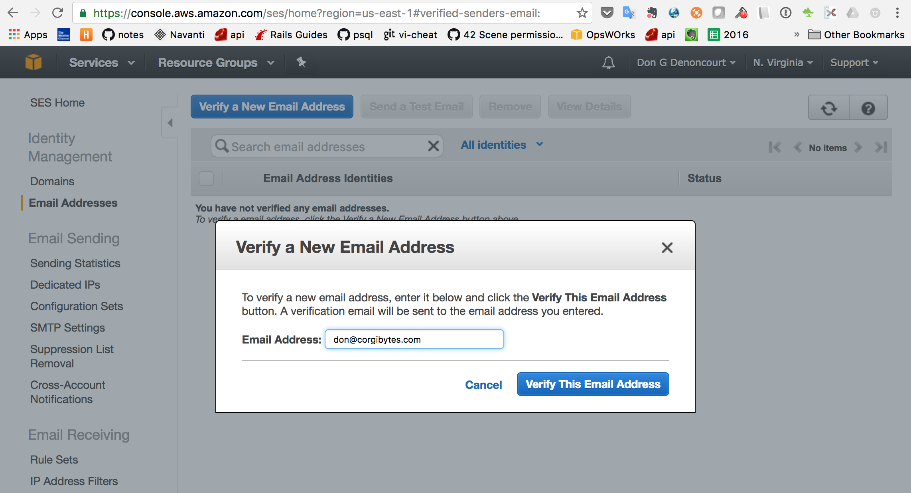

== AWS SES Mini-App with Bounce Notification Handline

This README would normally document whatever steps are necessary to get the
application up and running.

a real chicken or the egg.

* The application should be coded to handle AWS confiration requests before configuring SNS
* verify email addresses first
** Services drop-down menu click on SES, under Verified Senders in the left panel, Click on Email Addresses link, Click on Verify a New Email Address button 

{rdoc-image:http://example/image}[http://example/]

then shows [ses_verify_email_pending.png]
** the email addressee will receive an email with:
*** Subject: Amazon SES Address Verification Request
*** body with confirmation link, click that link in the email
** a refresh on the SES Verified Senders panel should replace "pending verification" with "verified"
* create topics before...

Things you may want to cover:

* Ruby version

* System dependencies

* Configuration

* Database creation

* Database initialization

* How to run the test suite

* Services (job queues, cache servers, search engines, etc.)

* Deployment instructions

* ...


Please feel free to use a different markup language if you do not plan to run
<tt>rake doc:app</tt>.


```ruby
class SimpleMailController < ApplicationController
  skip_before_filter :verify_authenticity_token # so AWS callbacks are accepted

  def mail_it
    logger.info "mail_it called with #{params}"
    @email = params[:email]
    SimpleMailer.mail_it(@email, 'original text').deliver
    render text: 'mail sent'
  end

  def bounce
    json = JSON.parse(request.raw_post)
    logger.info "bounce callback from AWS with #{json}"
    aws_needs_url_confirmed = json['SubscribeURL']
    if aws_needs_url_confirmed
      logger.info "AWS is requesting confirmation of the bounce handler URL"
      uri = URI.parse(aws_needs_url_confirmed)
      http = Net::HTTP.new(uri.host, uri.port)
      http.use_ssl = true
      http.verify_mode = OpenSSL::SSL::VERIFY_NONE
      http.get(uri.request_uri)
    else
      logger.info "AWS has sent us the following bounce notification(s): #{json}"
      SimpleMailer.mail_it('dondenoncourt@gmail.com', json).deliver
      json['bounce']['bouncedRecipients'].each do |recipient|
        logger.info "AWS SES received a bounce on an email send attempt to #{recipient['emailAddress']}"
      end
    end
    render nothing: true, status: 200
  end

end
```
